## 👋 About

I'm working through the KANT Private LLM Engineer program, step by step from machine-learning fundamentals to RAG, AI agents, LLMOps and model serving.
I learn by building the pieces LLMs need in real work — document search, information extraction and API servers.
부동산학 전공 경험을 살려, 도메인 지식이 필요한 문제에 LLM을 연결해 보는 데 관심이 많습니다.

## 🔭 Current Focus

지금은 LLM을 실제 서비스로 연결하는 구조와 안정적인 운영 방법에 집중하고 있습니다.

- **LLM application structure** — LangChain Prompt → Model → Parser, structured output and validation
- **Backends for LLMs** — designing document, query and Q&A APIs with FastAPI + Pydantic
- **Reliable external calls** — timeouts, bounded retries, backoff + jitter, fallbacks
- **Reproducible experiments** — baselines, train / validation / test splits, leakage checks, experiment logs
- **Deployment** — AWS DevOps course (배포까지 해내는 개발자) in parallel

## 🛠️ Tech Stack

| Area | Stack |
| --- | --- |
| Language |  |
| Data · ML |    |
| Deep Learning |   |
| LLM · Backend |     |
| Tools |     |

## 📌 Featured Work

### 🏗️ Housing Notice Q&A Chatbot `In progress`

청약홈 입주자모집공고문 PDF를 읽고 분양가·일정·대출·특별공급 조건에 답하는 로컬 LLM 챗봇입니다.

- Collected 30 notices and built a 20-item evaluation answer set (schema design → review → audit)
- Numbers are calculated in code, not by the LLM, and every answer cites the original sentence from the notice
- Local serving with FastAPI + Ollama in Docker, designed so vLLM can be swapped in
- Comparing 20 ways to read PDF tables (4 rule-based · 16 LLM-based)
- 공고문마다 표 형식이 달라서, 어떤 방법이 가장 정확한지 직접 비교하고 있습니다.

### [🔍 Document Search Project](https://github.com/ysl727727/doc-search-project)

Keyword baseline과 TF-IDF 검색을 구현하고 Precision@3, MRR로 성능을 비교한 프로젝트입니다.

- Text preprocessing and TF-IDF vectorization
- Cosine similarity implemented with NumPy
- Search evaluation set with Precision@3 and MRR
- Failure-case analysis and title-weighting experiments

### [🏠 Fake Real-Estate Listing Detector — Choosing a Local LLM](https://github.com/ysl727727/real-estate-fake-listing-detector)

매물 광고가 국토교통부 표시·광고 기준에 어긋나는지 판정하는 어시스턴트를 가정하고, 맞는 로컬 모델을 실험으로 골랐습니다.

- Compared `gemma3:4b` and `qwen3:4b-instruct` at the same size (4B) and quantization (Q4_K_M)
- 10 questions (normal · edge · out-of-scope), 40 runs in total, measuring quality and speed (RTX 5060 Laptop, 8 GB VRAM)
- Answer accuracy: gemma3 57.0% vs **qwen3 80.8%** — selected `qwen3:4b-instruct`
- Ran the same questions against a cloud API to check whether local operation is viable

### [📚 Today I Learned](https://github.com/ysl727727/TIL)

KANT 과정에서 배우고 직접 검증한 내용을 기록합니다. Exercises are marked done only when I have run them and can explain them.

| Track | Coverage |
| --- | --- |
| Machine Learning | Model evaluation, ensembles, bias–variance, imbalance & cross-validation, CV tuning |
| Deep Learning | PyTorch, MLP · CNN · RNN, Attention, tokenization, fine-tuning, PEFT |
| LLM in Practice | Logits · loss · optimizers, reliable LLM API calls |
| Data Engineering | API collection, cleaning & RAG document sets, FastAPI · Pydantic, async calls |
| LangChain | App structure, prompt templates, output parsers, LCEL, retrievers |

## 🗺️ Learning Roadmap

```mermaid
flowchart LR
    A[Machine Learning] --> B[Deep Learning] --> C[Transformer & LLM] --> D[LLM Application]
    D --> E[RAG] --> F[AI Agent] --> G[LLMOps] --> H[Private LLM Serving]

    classDef done fill:#dcfce7,stroke:#16a34a,color:#14532d
    classDef now fill:#fef3c7,stroke:#d97706,color:#78350f
    classDef next fill:#f3f4f6,stroke:#9ca3af,color:#374151
    class A,B,C done
    class D now
    class E,F,G,H next
```

## 🌱 Background

- B.A. in Real Estate, Konkuk University, Seoul (건국대학교 서울캠퍼스 부동산학과)
- 부동산 법규·고시를 읽고 판단 기준으로 정리하는 도메인 이해 — [허위매물 탐지 어시스턴트](https://github.com/ysl727727/real-estate-fake-listing-detector)에서 국토부 표시·광고 기준을 평가 문항으로 설계
- KANT Private LLM Engineer program

## 💡 What I Value

- 모르는 부분은 추측하지 않고 직접 확인합니다.
- 높은 숫자 하나보다 문제 비용에 맞는 평가 기준을 먼저 정의합니다.
- 결과뿐 아니라 가정, 실험 과정과 실패 사례를 함께 기록합니다.
- 오류를 재현하고 사용자 피드백을 개선으로 연결하는 운영을 지향합니다.

<picture>
  <source media="(prefers-color-scheme: dark)" srcset="https://streak-stats.demolab.com?user=ysl727727&theme=dark&hide_border=true&background=0D1117" />
  
</picture>

