# 이용석

`LLM Engineer in Progress`

**근거를 직접 확인하고, 결과를 반복해서 검토하는** 
**신뢰할 수 있는 LLM 서비스를 만들고 운영하는 엔지니어**를 목표로 합니다.

## 👋 About

KANT의 Private LLM 엔지니어 교육과정에서 머신러닝 기초부터 RAG, AI Agent, LLMOps와 LLM 서빙까지 단계적으로 학습하고 있습니다.
장기적으로는 부동산 도메인 지식과 LLM 기술을 연결해, **출처와 기준시점을 제시하고 불확실성을 구분하는 서비스**를 만들고 싶습니다.

## 🔭 Current Focus

- **LLM 애플리케이션 구조** — LangChain의 Prompt → Model → Parser, 구조화된 출력과 결과 검증
- **LLM을 붙이는 백엔드** — FastAPI + Pydantic으로 문서 등록·조회·질문 API 설계
- **안정적인 외부 호출** — timeout, 제한된 재시도, Backoff + Jitter, fallback 설계
- **재현 가능한 실험** — baseline 비교, train / validation / test 분리, 누수 방지, 실험 기록
- **배포** — AWS DevOps 특강(배포까지 해내는 개발자) 병행

## 🛠️ Tech Stack

| 분야 | 기술 |
| --- | --- |
| Language |  |
| Data · ML |    |
| Deep Learning |   |
| LLM · Backend |     |
| Tools |     |

## 📌 Featured Work

### [🔍 Document Search Project](https://github.com/ysl727727/doc-search-project)

Keyword baseline과 TF-IDF 검색을 구현하고 Precision@3, MRR로 성능을 비교한 문서 검색 프로젝트입니다.

- 텍스트 전처리 및 TF-IDF 벡터화
- NumPy 기반 cosine similarity 구현
- 검색 평가 세트와 Precision@3, MRR 적용
- 실패 사례 분석 및 title weighting 실험

### [📚 Today I Learned](https://github.com/ysl727727/TIL)

Private LLM 엔지니어 교육과정에서 배우고 직접 검증한 내용을 기록합니다. 실습은 직접 실행하고 설명할 수 있을 때만 완료로 표시합니다.

| 트랙 | 기록 범위 |
| --- | --- |
| 머신러닝 | 모델 평가, 앙상블, 편향·분산, 불균형·교차검증, CV 튜닝 |
| 딥러닝 기초·심화 | PyTorch, MLP·CNN·RNN, Attention, Tokenization, Fine-tuning, PEFT |
| LLM 실전 | Logit·Loss·Optimizer, 안정적인 LLM API 호출 |
| 데이터 엔지니어링 | API 수집, 정제와 RAG 문서셋, FastAPI·Pydantic, 비동기 호출 |
| LangChain | 앱 구조, Prompt Template, Output Parser |

## 🗺️ Learning Roadmap

```mermaid
flowchart LR
    A[Machine Learning] --> B[Deep Learning] --> C[Transformer & LLM] --> D[LLM Application]
    D --> E[RAG] --> F[AI Agent] --> G[LLMOps] --> H[Private LLM Serving]

    classDef done fill:#dcfce7,stroke:#16a34a,color:#14532d
    classDef now fill:#fef3c7,stroke:#d97706,color:#78350f
    classDef next fill:#f3f4f6,stroke:#9ca3af,color:#374151
    class A,B,C done
    class D now
    class E,F,G,H next
```

## 🌱 Background

- 건국대학교 부동산학과
- 감정평가 프로젝트에서 3가지 평가방식의 계산·검토 및 DCF 수익방식 발표
- 전문자격시험 준비 경험 이후 AI 엔지니어로 직무 전환
- KANT Private LLM 엔지니어 교육과정 참여

## 💡 What I Value

- 근거가 부족한 부분을 추측으로 넘기지 않습니다.
- 높은 숫자 하나보다 문제 비용에 맞는 평가 기준을 먼저 정의합니다.
- 결과뿐 아니라 가정, 실험 과정과 실패 사례를 함께 기록합니다.
- 오류를 재현하고 사용자 피드백을 개선으로 연결하는 운영을 지향합니다.

<picture>
  <source media="(prefers-color-scheme: dark)" srcset="https://streak-stats.demolab.com?user=ysl727727&theme=dark&hide_border=true&background=0D1117&locale=ko" />
  
</picture>

